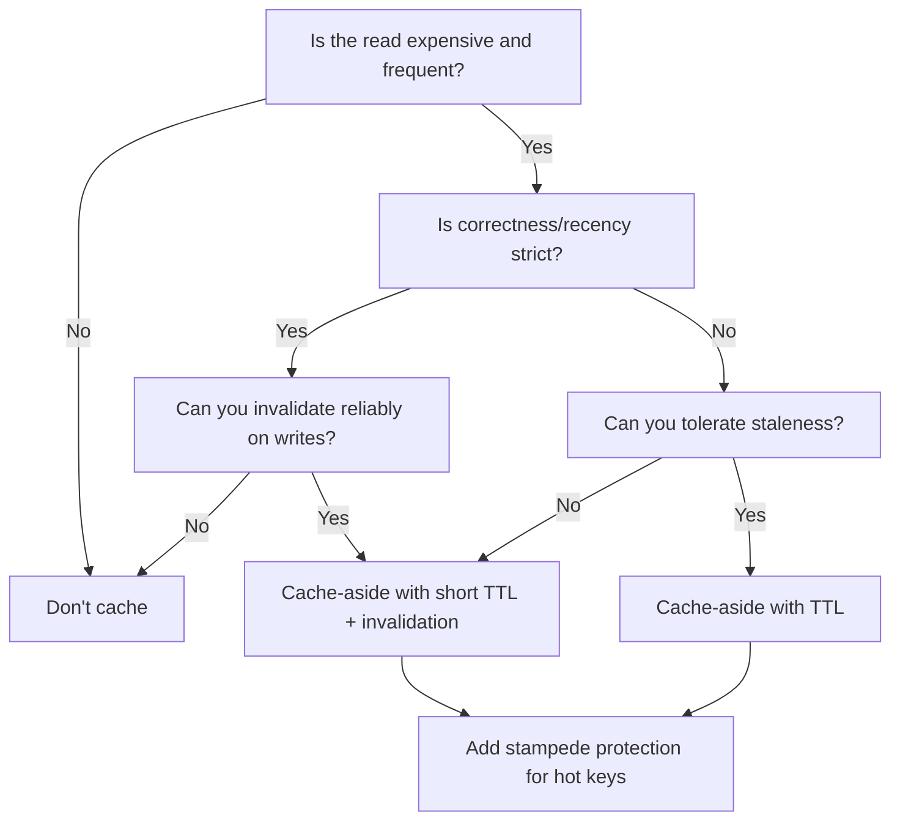

# Day 26 — Performance, Scaling & Advanced Backend Research

## How This README Is Written (Senior Engineer Style)

This document prioritizes:

- measurable bottlenecks (query plans, latency, throughput)
- tradeoffs (read vs write, simplicity vs scale)
- production constraints (failure modes, cache consistency, replication lag)

Use it as both a study guide and an implementation checklist.

---

## Table of Contents

- [Day 26 — Performance, Scaling \& Advanced Backend Research](#day-26--performance-scaling--advanced-backend-research)
  - [How This README Is Written (Senior Engineer Style)](#how-this-readme-is-written-senior-engineer-style)
  - [Table of Contents](#table-of-contents)
  - [Author’s Perspective (Senior Mindset)](#authors-perspective-senior-mindset)
  - [The Senior Research Framework (What/Why/How)](#the-senior-research-framework-whatwhyhow)
  - [1) Performance Reality: Most Slowness Is Data Movement](#1-performance-reality-most-slowness-is-data-movement)
  - [2) Database Optimization (Queries + Plans)](#2-database-optimization-queries--plans)
    - [Why databases become bottlenecks](#why-databases-become-bottlenecks)
    - [What makes queries slow (typical causes)](#what-makes-queries-slow-typical-causes)
    - [Senior solution: use query plans, not guesses](#senior-solution-use-query-plans-not-guesses)
  - [3) Indexing Strategies (B-Tree/Hash/GIN + Tradeoffs)](#3-indexing-strategies-b-treehashgin--tradeoffs)
    - [Why indexes exist](#why-indexes-exist)
    - [Common index types (PostgreSQL-oriented)](#common-index-types-postgresql-oriented)
    - [The biggest indexing truth (tradeoff)](#the-biggest-indexing-truth-tradeoff)
    - [Composite indexes](#composite-indexes)
    - [Covering indexes](#covering-indexes)
  - [4) ORM Pitfalls: The N+1 Query Problem](#4-orm-pitfalls-the-n1-query-problem)
    - [The problem](#the-problem)
    - [Why it happens](#why-it-happens)
    - [Senior solutions](#senior-solutions)
  - [5) Join Optimization + Denormalization Tradeoffs](#5-join-optimization--denormalization-tradeoffs)
    - [Why joins become slow](#why-joins-become-slow)
    - [Optimization strategies](#optimization-strategies)
  - [6) Pagination Performance (Offset vs Cursor)](#6-pagination-performance-offset-vs-cursor)
    - [Offset pagination](#offset-pagination)
    - [Cursor pagination](#cursor-pagination)
  - [7) Search at Scale (DB Full-Text vs Search Engines)](#7-search-at-scale-db-full-text-vs-search-engines)
    - [Why `LIKE '%term%'` fails](#why-like-term-fails)
    - [Senior solutions](#senior-solutions-1)
  - [8) Connection Pooling (Why Systems Collapse Without It)](#8-connection-pooling-why-systems-collapse-without-it)
  - [9) Caching \& Redis (Patterns, Invalidation, Stampedes)](#9-caching--redis-patterns-invalidation-stampedes)
    - [Why caching exists](#why-caching-exists)
    - [Common cache patterns](#common-cache-patterns)
    - [The hardest part: cache invalidation](#the-hardest-part-cache-invalidation)
    - [Cache stampede](#cache-stampede)
    - [When not to cache](#when-not-to-cache)
  - [10) Scaling (Vertical vs Horizontal) + Load Balancing](#10-scaling-vertical-vs-horizontal--load-balancing)
    - [Vertical scaling](#vertical-scaling)
    - [Horizontal scaling](#horizontal-scaling)
    - [Load balancing](#load-balancing)
  - [11) Replication \& Sharding (When Data Scaling Becomes Necessary)](#11-replication--sharding-when-data-scaling-becomes-necessary)
    - [Replication](#replication)
    - [Sharding](#sharding)
  - [12) Application-Level Optimization (Measure First, Then Optimize)](#12-application-level-optimization-measure-first-then-optimize)
  - [13) Asynchronous Processing (Responsiveness at Scale)](#13-asynchronous-processing-responsiveness-at-scale)
  - [14) CDN + Compression (Latency and Bandwidth Engineering)](#14-cdn--compression-latency-and-bandwidth-engineering)
  - [15) Monitoring \& Observability (Tools + Why They Matter)](#15-monitoring--observability-tools--why-they-matter)
  - [16) API Styles and Realtime Tradeoffs (REST/GraphQL/gRPC/WebSockets/SSE)](#16-api-styles-and-realtime-tradeoffs-restgraphqlgrpcwebsocketssse)
    - [REST](#rest)
    - [GraphQL](#graphql)
    - [gRPC](#grpc)
    - [WebSockets vs SSE](#websockets-vs-sse)
  - [17) Security for Production APIs (OWASP + Practical Controls)](#17-security-for-production-apis-owasp--practical-controls)
  - [Practice Plan (Hands-On Optimizations)](#practice-plan-hands-on-optimizations)
    - [A) Pick a workload + define success criteria](#a-pick-a-workload--define-success-criteria)
    - [B) Baseline measurement (before)](#b-baseline-measurement-before)
    - [C) Database query optimization loop](#c-database-query-optimization-loop)
    - [D) Add connection pooling](#d-add-connection-pooling)
    - [E) Add query result caching (carefully)](#e-add-query-result-caching-carefully)
    - [F) Re-measure and summarize](#f-re-measure-and-summarize)
  - [Optimization Guide (Checklists + Decision Tree)](#optimization-guide-checklists--decision-tree)
    - [1) Database optimization checklist](#1-database-optimization-checklist)
    - [2) Index creation strategy (document template)](#2-index-creation-strategy-document-template)
    - [3) Cache decision tree](#3-cache-decision-tree)
    - [4) Performance monitoring setup (basic)](#4-performance-monitoring-setup-basic)
    - [5) Scaling strategy recommendations](#5-scaling-strategy-recommendations)
  - [Industry Case Studies (How Big Systems Think)](#industry-case-studies-how-big-systems-think)
    - [Netflix — observability and distributed debugging](#netflix--observability-and-distributed-debugging)
    - [Meta — GraphQL for frontend productivity](#meta--graphql-for-frontend-productivity)
    - [Google — gRPC + reliability discipline](#google--grpc--reliability-discipline)
    - [Amazon — load balancing + gateways + scale engineering](#amazon--load-balancing--gateways--scale-engineering)
    - [Swiggy/Zomato — ETA is business-critical](#swiggyzomato--eta-is-business-critical)
  - [Final Takeaways](#final-takeaways)
  - [Sources](#sources)

---

## Author’s Perspective (Senior Mindset)

Most beginners think backend performance means:

```text
"make code faster"
```

Real backend engineering is deeper.

At scale, performance problems become:

- infrastructure cost problems
- user experience problems
- database bottleneck problems
- scaling problems
- distributed systems problems
- reliability problems

A senior engineer does not ask:

```text
"How can I optimize this loop?"
```

They ask:

```text
"What is the actual bottleneck?"
"Is the database slow?"
"Is the network slow?"
"Is the cache missing?"
"Is scaling inefficient?"
"Are we wasting infrastructure?"
"Are users waiting too long?"
```

---

## The Senior Research Framework (What/Why/How)

For each concept below, I framed my research as:

- What problem existed?
- Why did the older approach fail at scale?
- What does the new approach solve?
- What new problems does it create?
- Who uses it and under what conditions?

This proves practical understanding beyond “just tutorials”.

---

## 1) Performance Reality: Most Slowness Is Data Movement

The most important performance engineering truth:

Most systems are not slow because of CPU computation.

They are slow because of:

- database access
- network latency
- disk I/O
- unoptimized queries
- missing indexes
- chatty APIs
- poor caching
- blocking operations

So performance engineering is mostly:

```text
data movement optimization
```

---

## 2) Database Optimization (Queries + Plans)

### Why databases become bottlenecks

Databases are usually the first major bottleneck because almost every request touches them.

Even “small” inefficiencies multiply:

```text
1 query = 5ms (fine)
10 million queries/day (pain)
```

That becomes:

- infrastructure cost
- user latency
- CPU pressure
- connection exhaustion

### What makes queries slow (typical causes)

| Problem | Why it hurts |
|---|---|
| full table scans | checks every row |
| missing indexes | slow lookups |
| large joins | memory + CPU overhead |
| returning unnecessary columns | network waste |
| repeated queries | extra DB pressure |
| unbounded pagination | massive scans |

### Senior solution: use query plans, not guesses

Use `EXPLAIN ANALYZE` to inspect reality:

```sql
EXPLAIN ANALYZE
SELECT * FROM orders WHERE user_id = 5;
```

This reveals:

- whether indexes are used
- scan type
- estimated cost vs actual time
- rows scanned

---

## 3) Indexing Strategies (B-Tree/Hash/GIN + Tradeoffs)

### Why indexes exist

Without indexes, databases scan rows one-by-one.

Example:

```sql
SELECT * FROM users WHERE email = 'abc@gmail.com';
```

With indexes, the DB can “jump” to matching rows.

Analogy:

- without index: reading the entire book to find one topic
- with index: using the index page

### Common index types (PostgreSQL-oriented)

- B-Tree: best general-purpose index (equality, ranges, sorting)
- Hash: equality lookups (less commonly used)
- GIN: full-text search, JSONB, arrays

Example:

```sql
CREATE INDEX idx_users_email ON users(email);
```

### The biggest indexing truth (tradeoff)

Indexes speed up reads but hurt writes.

Every insert/update must also update indexes.

Senior rule:

```text
Index based on real query patterns, not guessing.
```

### Composite indexes

Problem: queries often filter by multiple columns.

```sql
CREATE INDEX idx_orders_user_status ON orders(user_id, status);
```

Important: index order matters.

### Covering indexes

If the index contains all needed columns, the DB can answer directly from the index (less disk I/O).

PostgreSQL example using `INCLUDE` (index supports filtering + returns extra columns without hitting the table):

```sql
CREATE INDEX idx_orders_user_created_include_total
ON orders (user_id, created_at)
INCLUDE (total_amount, status);
```

---

## 4) ORM Pitfalls: The N+1 Query Problem

### The problem

Load 100 orders, and then for each order load customer data:

```text
1 + 100 queries
```

Works at small scale; destroys performance at scale.

### Why it happens

ORMs hide queries, so developers accidentally create hundreds of DB round trips.

### Senior solutions

- eager loading (fetch related data together)
- batching (use `WHERE id IN (...)`)

Senior question:

```text
"How many DB round trips exist in this request?"
```

---

## 5) Join Optimization + Denormalization Tradeoffs

### Why joins become slow

Large joins are expensive, especially:

- unindexed join columns
- wide tables
- nested joins

### Optimization strategies

| Strategy | Benefit |
|---|---|
| index join columns | faster matching |
| select fewer columns | less memory/network |
| denormalize carefully | fewer joins |
| materialized views | precomputed results |

Tradeoff:

- normalization improves consistency
- denormalization improves speed

Real systems balance both.

---

## 6) Pagination Performance (Offset vs Cursor)

### Offset pagination

```sql
LIMIT 20 OFFSET 10000
```

Problem: DB still scans skipped rows → large offsets become slow.

### Cursor pagination

```sql
WHERE id > 5000
LIMIT 20
```

Faster at scale. Common in social feeds and infinite scroll.

---

## 7) Search at Scale (DB Full-Text vs Search Engines)

### Why `LIKE '%term%'` fails

```sql
WHERE title LIKE '%backend%'
```

Very slow and hard to scale.

### Senior solutions

- database full-text search (e.g., PostgreSQL + GIN)
- external search engines (Elasticsearch/OpenSearch/Solr)

PostgreSQL full-text example (illustrative):

```sql
-- 1) Create a tsvector (either computed on the fly or stored)
-- Stored column approach:
ALTER TABLE articles
ADD COLUMN search_vector tsvector;

UPDATE articles
SET search_vector = to_tsvector('english', coalesce(title,'') || ' ' || coalesce(body,''));

-- 2) Index it with GIN
CREATE INDEX idx_articles_search_vector
ON articles USING GIN (search_vector);

-- 3) Query using tsquery
SELECT id, title
FROM articles
WHERE search_vector @@ plainto_tsquery('english', 'backend optimization');
```

Tradeoff:

- external search adds operational overhead but scales better as search becomes specialized.

---

## 8) Connection Pooling (Why Systems Collapse Without It)

Opening DB connections is expensive.

If every request opens a new connection, systems collapse under load.

Pooling:

- reuses connections
- reduces latency
- prevents connection exhaustion

Common production approach for Postgres:

- app-level pool (via your ORM/driver)
- or a dedicated pooler like PgBouncer (reduces DB connection churn)

---

## 9) Caching & Redis (Patterns, Invalidation, Stampedes)

### Why caching exists

Repeated identical DB queries waste resources.

Typical impact:

```text
DB query ~50ms
Redis cache ~1ms
```

### Common cache patterns

**Cache-aside** (most common):

```text
check cache → miss → query DB → store in cache
```

**Write-through**:

```text
application → cache → database
```

### The hardest part: cache invalidation

Stale cache creates real business bugs (wrong plans, wrong statuses, wrong pricing).

### Cache stampede

When cache expires and a traffic spike arrives, thousands of requests hit DB simultaneously.

Prevention strategies:

- staggered expiration
- distributed locks (one request rebuilds cache)
- background refresh

### When not to cache

Avoid caching:

- rapidly changing critical data
- highly volatile personalized state
- security-sensitive temporary state

---

## 10) Scaling (Vertical vs Horizontal) + Load Balancing

### Vertical scaling

Bigger server (more CPU/RAM). Easy initially, but hits limits.

### Horizontal scaling

More servers + distribute traffic. Harder operationally, but scales further.

### Load balancing

Problem: one server overloaded while others idle.

Load balancing distributes traffic for:

- availability
- utilization
- fault tolerance

Common strategies:

| Strategy | Description |
|---|---|
| round robin | rotate requests |
| least connections | send to least busy |
| IP hash | same user → same server |

Sticky sessions are useful for session state and WebSockets, but reduce flexibility.

---

## 11) Replication & Sharding (When Data Scaling Becomes Necessary)

### Replication

Master handles writes; replicas serve reads.

Benefit: read scaling + redundancy.

New problem: replication lag → eventual consistency.

### Sharding

Split data across databases when one DB cannot handle size/traffic.

Example:

```text
Users A–M → shard 1
Users N–Z → shard 2
```

Hard parts:

- cross-shard queries
- rebalancing
- operational complexity

Use only at very large scale.

---

## 12) Application-Level Optimization (Measure First, Then Optimize)

Senior rule:

```text
Measure first. Optimize second.
```

Use profilers to measure:

- slow functions
- memory usage
- CPU bottlenecks

Common Python tools (pick based on what you need to prove):

- `cProfile` / `pstats` (baseline CPU profiling)
- `py-spy` (sampling profiler; good for production-like runs)
- `scalene` (CPU + memory + native time)
- `tracemalloc` (memory allocation tracking)

Workflow:

1. reproduce the slowness with a realistic workload
2. profile to find top hotspots
3. optimize the bottleneck (algorithm, I/O, DB calls, batching)
4. re-run the same workload and compare numbers

---

## 13) Asynchronous Processing (Responsiveness at Scale)

Do not block user requests for slow tasks.

Example:

- Bad: upload resume → wait 30s AI analysis
- Good: upload resume → queue job → respond immediately

Async processing improves responsiveness and protects latency SLOs.

---

## 14) CDN + Compression (Latency and Bandwidth Engineering)

Distance creates latency.

CDNs cache static assets globally (images, JS, CSS, video).

Benefits:

- lower latency
- reduced origin traffic
- improved scalability

Also:

- image optimization (resize + compress + modern formats like WebP/AVIF)
- response compression (gzip/Brotli)

---

## 15) Monitoring & Observability (Tools + Why They Matter)

Without monitoring, production failures become:

```text
"system slow"
```

With observability, engineers can identify:

```text
which service / query / endpoint / dependency
```

Tools mentioned in research:

- Prometheus (metrics)
- Grafana (dashboards)
- ELK stack (log collection + search + visualization)
- APM tools (New Relic / Datadog) for tracing, alerts, performance insights

---

## 16) API Styles and Realtime Tradeoffs (REST/GraphQL/gRPC/WebSockets/SSE)

### REST

- Best for: public APIs and broad compatibility
- Tradeoff: overfetching/underfetching, multiple calls

### GraphQL

- Problem it solves: frontend requests exactly required fields (mobile + UI velocity)
- New problems: caching complexity, query cost controls, backend complexity

### gRPC

- Problem it solves: efficient internal service-to-service communication
- New problems: tooling/IDL discipline, harder human debugging

### WebSockets vs SSE

- WebSockets: two-way realtime (chat, collaboration)
- SSE: one-way server push (dashboards, streaming responses)

Polling fails at scale due to waste (bandwidth, battery, server load), but WebSockets introduce connection management and load-balancing complexity.

---

## 17) Security for Production APIs (OWASP + Practical Controls)

Security must be designed in, not “added later”.

OWASP Top 10 (high-level categories):

- Broken access control
- Cryptographic failures
- Injection
- Insecure design
- Security misconfiguration
- Vulnerable and outdated components
- Identification and authentication failures
- Software and data integrity failures
- Security logging and monitoring failures
- SSRF

Practical controls:

- authentication + authorization (least privilege)
- input validation + safe query practices
- rate limiting + abuse detection
- TLS everywhere
- secrets management (env vars / secret managers; no hardcoding)
- audit logs for security events

---

## Practice Plan (Hands-On Optimizations)

This section is the actionable implementation plan for the Day 26 tasks.

### A) Pick a workload + define success criteria

Choose 1–2 endpoints/queries that represent real usage (examples: feed, orders list, search, profile page).

Define measurable targets (pick what makes sense):

- p95 latency (e.g., reduce by 30–50%)
- throughput (RPS)
- DB load (CPU, I/O, active connections)
- error rate/timeouts
- cost (if applicable)

### B) Baseline measurement (before)

Capture **before** metrics so improvements are real, not guessed.

- App timing: request duration, slow endpoints
- DB timing: slow query log / query stats
- For a slow query: run `EXPLAIN (ANALYZE, BUFFERS)` (Postgres)

Template to fill in:

```text
Workload:
Baseline date/time:

Latency:
  p50:
  p95:
  p99:
Throughput (RPS):
Errors/timeouts:

DB:
  CPU:
  active connections:
  top slow query:

Notes:
```

### C) Database query optimization loop

Use this loop per query:

1. Reduce data scanned (filters, pagination strategy)
2. Reduce data returned (select only needed columns)
3. Add the *right* index (based on real predicate + ordering)
4. Re-check plan and measure again

Before/after evidence template (recommended for deliverable):

```sql
-- Query
SELECT ...

-- BEFORE: paste your EXPLAIN ANALYZE output here

-- Change made:
-- 1) query rewrite OR 2) index added OR 3) schema adjustment

-- AFTER: paste your new EXPLAIN ANALYZE output here
```

### D) Add connection pooling

Goal: avoid per-request connection creation and prevent DB exhaustion.

Checklist:

- confirm the app reuses connections (pool enabled)
- set pool size based on DB limits and concurrency
- set timeouts (connect/read) so failures degrade gracefully

Measurement idea:

- compare DB connection counts under load before vs after

### E) Add query result caching (carefully)

Start with cache-aside for expensive, frequently repeated reads.

Checklist:

- pick stable keys (e.g., `user:{id}:profile:v1`)
- choose TTL intentionally (avoid “forever”)
- define invalidation triggers
- add stampede prevention for hot keys

Evidence template:

```text
Cached item:
Cache key pattern:
TTL:
Invalidation approach:
Stampede prevention:
Before vs after DB QPS:
Before vs after p95 latency:
```

### F) Re-measure and summarize

Your final write-up should include:

- what changed
- why it helped
- what tradeoff it introduced
- measured before/after

---

## Optimization Guide (Checklists + Decision Tree)

This section is the “guide deliverable”: something you can reuse in future projects.

### 1) Database optimization checklist

- Confirm the slow part is DB (not network, cache misses, external APIs)
- Identify top slow queries (real production-like workload)
- For each slow query:
  - run `EXPLAIN ANALYZE` (and `BUFFERS` in Postgres)
  - check for sequential scans on large tables
  - ensure filters match indexable predicates
  - avoid `SELECT *` on hot paths
  - reduce N+1 patterns by batching/eager-loading
- Validate that improvements are measurable (latency and DB load)

### 2) Index creation strategy (document template)

Use this table as your “index strategy document”:

| Query / endpoint | Access pattern | Proposed index | Why this index | Write overhead risk | Verification (plan/benchmark) |
|---|---|---|---|---|---|
| `/orders?user_id=...&status=...` | filter + sort | `(user_id, status, created_at)` | supports predicate + ordering | medium | paste EXPLAIN + p95 |

Rules of thumb (practical, not absolute):

- Indexes are not free: they increase write cost and storage, and can bloat.
- Create indexes based on observed query patterns.
- Composite index order matters (leftmost prefix rule).
- Covering indexes help when you consistently fetch a small set of columns.
- Avoid indexing low-selectivity columns alone (e.g., booleans) unless combined.

### 3) Cache decision tree

Use this to decide whether caching is appropriate.



Stampede prevention options:

- jittered TTLs (randomized expiration)
- single-flight rebuild (lock so only one request recomputes)
- background refresh

### 4) Performance monitoring setup (basic)

Minimum viable observability for optimization work:

- Metrics (Prometheus)
  - request count, latency buckets (p50/p95/p99), error rate
  - DB connection usage, DB query duration (if instrumented)
- Dashboards (Grafana)
  - endpoint latency by route
  - top erroring endpoints
  - DB saturation indicators
- Logs (ELK)
  - structured request logs (request id, user id if safe, duration)
  - slow query logs (or references to query IDs)
- APM (New Relic / Datadog)
  - distributed tracing across services/dependencies

### 5) Scaling strategy recommendations

Use this as a quick proposal template.

```text
Current bottleneck (measured):

Near-term:
  - Vertical scale: (what resource, why, expected gain)
  - Query/index fixes: (top 2 changes)
  - Caching: (what, TTL, invalidation)

Mid-term:
  - Horizontal scale: (stateless app, autoscaling, LB strategy)
  - Sticky sessions needed? (yes/no + why)
  - Replication plan: (read replicas, lag handling)

Long-term (only if required):
  - Sharding triggers: (data size, write throughput, hot partitions)
  - Shard key choice:
  - Cross-shard query strategy:
```

---

## Industry Case Studies (How Big Systems Think)

These examples show this is researched as real-world architecture, not just definitions.

### Netflix — observability and distributed debugging

When one request crosses many services, “where did it fail?” requires logs + metrics + tracing.

### Meta — GraphQL for frontend productivity

GraphQL addresses overfetching/underfetching and fast-evolving UI needs, but demands query cost controls and careful caching.

### Google — gRPC + reliability discipline

Internal typed RPC contracts help at high throughput; reliability practices (SRE thinking) make systems operable.

### Amazon — load balancing + gateways + scale engineering

Gateways centralize policy (auth, rate limits) and reduce client complexity, but must be scaled and governed.

### Swiggy/Zomato — ETA is business-critical

ETA is not `distance/speed`; real systems combine realtime tracking + historical data + prediction models + event updates.

---

## Final Takeaways

- Performance engineering is latency/throughput/cost/reliability engineering.
- Premature optimization is dangerous; optimize measured bottlenecks.
- Most bottlenecks are data movement problems (DB/network/cache), not CPU loops.
- Every solution (indexes, caching, replication, microservices) introduces new problems.

---

## Sources

- gRPC: https://grpc.io/
- GraphQL: https://graphql.org/
- Google SRE books: https://sre.google/books/
- Netflix Tech Blog: https://netflixtechblog.com/
- AWS API Gateway docs: https://docs.aws.amazon.com/apigateway/
- PostgreSQL EXPLAIN: https://www.postgresql.org/docs/current/using-explain.html
- PostgreSQL Indexes: https://www.postgresql.org/docs/current/indexes.html
- PgBouncer: https://www.pgbouncer.org/
- Redis (caching concepts + commands): https://redis.io/
