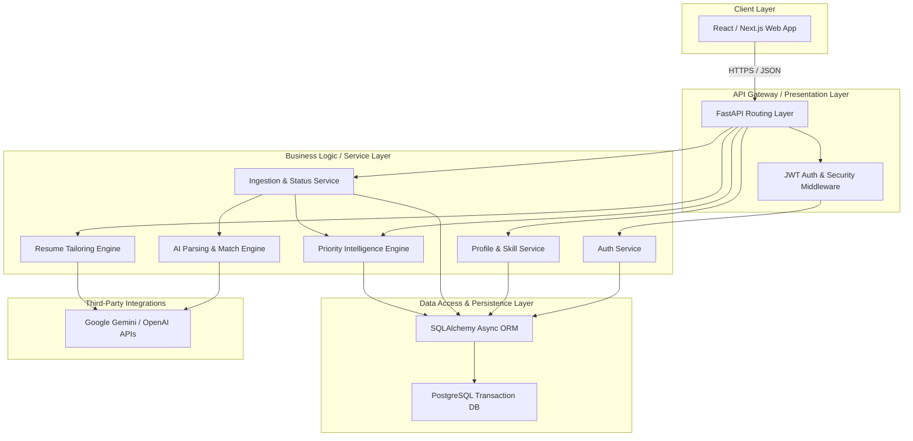
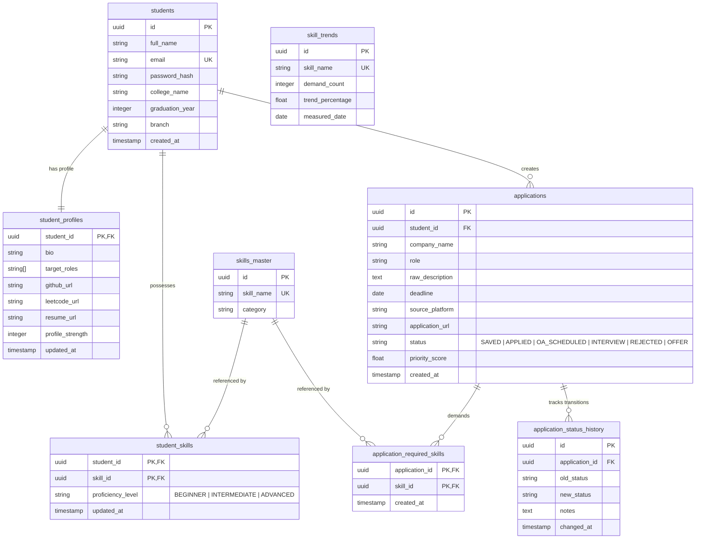

# Project Proposal: Rythm
## AI-Powered Student Career Workflow Intelligence Platform

GitHub: https://github.com/bhargava562/rythm

---

## 1. Executive Summary

In today's highly competitive job market, engineering and technical students face an overwhelming and fragmented career search environment. Students manage applications across multiple portals (LinkedIn, Naukri, AICTE, Internshala, and university training & placement channels), track milestones in disjointed spreadsheets, and manually tailor resumes without clear, context-aware direction.

**Rythm** is a **state-driven career workflow orchestration system** that addresses this fragmentation. It consolidates scattered resources, analyzes candidate profiles, automates semantic job parsing, performs real-time skill gap analysis, and intelligently prioritizes opportunities using a weighted mathematical algorithm.

Unlike traditional CRUD-based job trackers, Rythm builds a **continuously evolving intelligence graph**. Each user interaction—from updating a skill to pasting a job description—triggers **state transitions**, recalibrates **priority scores**, and refines **tailoring recommendations**.

---

## 2. Problem Statement & Tech Opportunity

### Traditional System Failures

1. **Spreadsheet Fatigue**: Students lose track of critical application steps (OA deadlines, interview schedules) because tracking is passive.
2. **Generic Resume Tailoring**: General resumes fail to pass Automated Applicant Tracking Systems (ATS) due to a lack of keyword alignment.
3. **Information Overload**: Students cannot easily identify which opportunities match their skills best, or which ones to prioritize based on proximity to deadlines.
4. **Static Skill Assessment**: Students are unaware of the exact skills required by current market trends, causing them to focus on outdated tools.

### The Rythm Opportunity

Rythm changes the paradigm by combining a **normalized database schema** with **LLM-based semantic parsing** to bridge the gap between candidate readiness and market demand.

Instead of attempting brittle web scraping of restricted job boards, Rythm implements a clean **paste-based ingestion** system that uses Large Language Models (LLMs) to:

- extract key parameters from job descriptions,
- map them to a central skills catalog,
- output immediate, actionable feedback to the student.

---

## 3. Core Workflow Architecture (Phases 1 — 10)

> Diagram placeholder: System Architecture Workflow
> 
> In a full implementation, this would be documented in a dedicated architecture document.

### Phase 1: Student Registration & Secure Identity

- **Action**: Registration validates name, email, college, graduation year, branch, and credentials.
- **Security principle**:
  - Passwords are hashed with `bcrypt` before being stored.
  - UUIDs are used for public/private identifiers to prevent enumeration attacks (avoids `/student/1`, `/student/2`).
- **Output**: Secure session package (JWT access token, secure HTTP-only refresh token) and initial identity profile.

### Phase 2: Unified Career Profile Initialization

- **Action**: Onboarding where students establish target roles, current skill levels, and portfolio handles (GitHub, LeetCode, resume URLs).
- **Database normalization**: Skills are stored via a normalized mapping table (e.g., `student_skills`) referencing a centralized catalog (`skills_master`).
- **Output**: Dashboard initializes with a computed **profile strength metric** (example: 42%).

### Phase 3: Opportunity Ingestion (Core Tracking)

- **Action**: Student copy-pastes raw job description text, title, company, URL, and deadlines.
- **Architecture choice**: User-driven ingestion instead of scraping.
- **Why**: Avoids API restrictions, anti-bot mechanisms, brittle infra, and auth barriers across job boards.

### Phase 4: AI Parsing & Semantic Extraction Engine

- **Action**: Raw description is parsed by an LLM via prompt engineering.
- **Parsing target**: Extracts technical skills, frameworks, domain categories, and experience level into structured JSON.
- **Database mapping**: Extracted strings (e.g., “Spring Boot”) are mapped into `skills_master`. New skills can be appended.

### Phase 5: Skill Match & Gap Analysis Engine

- **Action**: Compute intersection of student skills and required opportunity skills.

$$
\text{Match Score} = \frac{|\text{Student Skills} \cap \text{Required Skills}|}{|\text{Required Skills}|}
$$

- **Output**: Matching percentage and explicit missing skills (e.g., “Docker”, “REST APIs”).

### Phase 6: Priority Intelligence Engine

- **Action**: Opportunities are ranked using a dynamic weighted prioritization algorithm.

$$
\text{Priority} = (w_1 \times \text{Urgency}) + (w_2 \times \text{Skill Match}) + (w_3 \times \text{Trend Relevance}) + (w_4 \times \text{Interest})
$$

- **Purpose**: Surface urgent + high-fit opportunities at the top of the dashboard.

### Phase 7: Resume Tailoring Engine

- **Action**: The system combines student profile context, raw resume text, and parsed job description into an LLM request.
- **Output**: Keywords to add, bullets to optimize, and structure recommendations.
- **Control**: Student can accept, reject, or regenerate suggestions.

### Phase 8: Application Workflow Tracking

- **Action**: Applications move through a state machine:

$\text{Saved} \rightarrow \text{Applied} \rightarrow \text{OA Scheduled} \rightarrow \text{Interview} \rightarrow (\text{Rejected} \; | \; \text{Offer})$

- **State auditing**: Every status change is logged in `application_status_history` to measure cycle time, bottlenecks, and conversions.

### Phase 9: Analytics & Intelligence Layer

- **Action**: Aggregate analytics computed across a student’s history:
  - interview rate,
  - application velocity,
  - recurring missing skills,
  - funnel metrics.

### Phase 10: Adaptive Trend Intelligence (UVP)

- **Action**: Aggregate required skills across all ingested opportunities.
- **Unique value**: Identifies macro shifts in hiring requirements (example: “Kafka demand up 32% this month”).
- **Outcome**: Advises students what to learn next based on localized market demand.

---

## 4. Business & Educational Value

1. **Structured Career Development**: Shifts students from guessing what to learn to systematically tackling identified skill gaps.
2. **Optimized Interview Rates**: Tailored resumes improve ATS alignment and conversion rates.
3. **Actionable University Analytics**: Aggregated, anonymized insights can help universities identify curriculum-market alignment gaps.

---

# Rythm — Platform Overview

Rythm is a state-driven career workflow orchestration system designed to support students throughout career preparation and opportunity tracking. Rather than acting as a simple spreadsheet or CRUD job tracker, Rythm operates as a continuously evolving intelligence graph: every user action generates structured state, skill gap analytics, priority recommendations, and adaptive resume tailoring suggestions.

---

## Key Features

- **Student Registration & Secure Identity**: Hashed passwords using `bcrypt` and JWT session tracking, with UUID protection against enumeration attacks.
- **Unified Career Profile**: Centralized, queryable skills catalog (`skills_master`) mapping profile strength, target roles, and portfolio links.
- **Frictionless Ingestion (no unstable scrapers)**: Copy-paste job descriptions and details from job boards for local storage.
- **AI Parsing & Semantic Extraction**: Auto-extract required skills, experience levels, and domains from raw descriptions.
- **Skill Match & Gap Analysis**: Computes matching metrics and identifies exact missing skills.
- **Priority Intelligence Engine**: Ranks opportunities using urgency, match, trends, and preference in a weighted scoring model.
- **Resume Tailoring Engine**: Context-engineered LLM recommendations to maximize relevance.
- **Status History Tracking**: Audit trail of application stages to compute funnel metrics.
- **Adaptive Trend Intelligence**: Aggregates cohort trends to highlight emerging in-demand skills.

---

## Technology Stack (Proposed)

- **Backend**: Python with FastAPI (async endpoints, Pydantic validation)
- **Database**: PostgreSQL (normalized relational schema)
- **ORM / Migrations**: SQLAlchemy (async) + Alembic
- **Security**: JWT + `bcrypt` hashing (via Passlib/bcrypt)
- **AI Engine**: LLM integrations (Gemini/OpenAI) via direct API calls or orchestration (e.g., LangChain)
- **Containerization**: Docker & Docker Compose

---

## System Architecture (High-Level)

---

## Relational Database ERD (Proposed)

---

## API Endpoints Specification Summary (Proposed)

All endpoints are prefixed with `/api/v1`.

### 1) Authentication

- `POST /auth/register` — Registers a new user, hashes password via bcrypt, creates base profile, returns access + refresh tokens.
- `POST /auth/login` — Verifies login and returns access token.

### 2) User Profiles

- `POST /profile/initialize` — Configures target roles, bio, and portfolio URLs; updates profile strength score.
- `GET /profile` — Retrieves student profile and metrics.
- `POST /profile/skills` — Adds/updates skills with level (BEGINNER/INTERMEDIATE/ADVANCED), mapped to `skills_master`.
- `GET /profile/skills` — Returns student skills.

### 3) Application Ingestion & Tracking

- `POST /applications/ingest` — Ingests job text; triggers skill extraction, gap analysis, and priority scoring.
- `GET /applications` — Lists opportunities sorted by `priority_score` (descending).
- `PATCH /applications/{id}/status` — Transitions state and logs to status history.

### 4) Career Intelligence

- `POST /applications/{id}/resume-tailor` — Compares resume vs opportunity; returns keyword/bullet recommendations.
- `GET /analytics/overview` — Returns funnel conversion metrics and missing skills.
- `GET /analytics/market-trends` — Returns hot skills and demand changes over time.

---

## Quick Start (Implementation-Oriented)

1. **Prerequisites**: Python 3.12+, PostgreSQL, and Docker.
2. **Environment**: Create a `.env` with DB and JWT settings.
3. **Dependencies**: Install backend requirements (FastAPI, SQLAlchemy, Alembic, auth libs).
4. **Run**: Start the API server via `uvicorn`.

---

## License

This proposal and concept are proprietary and confidential under the codename **Rythm**.
