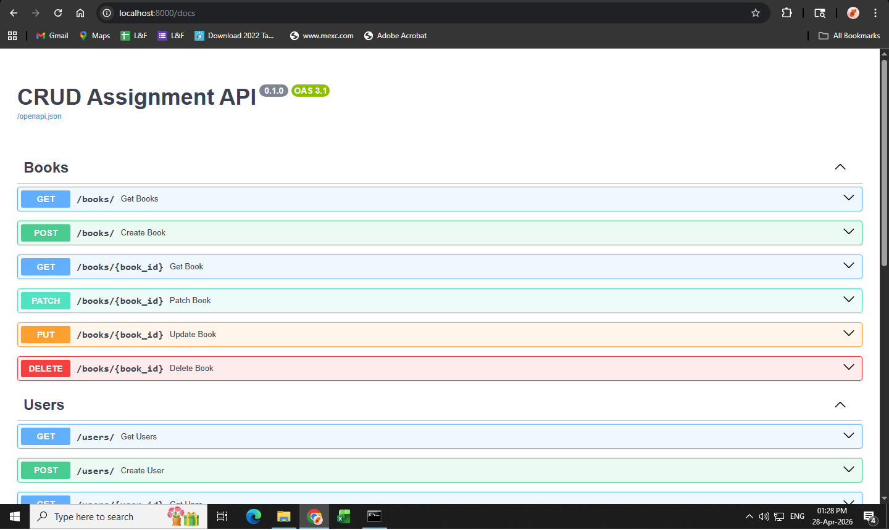
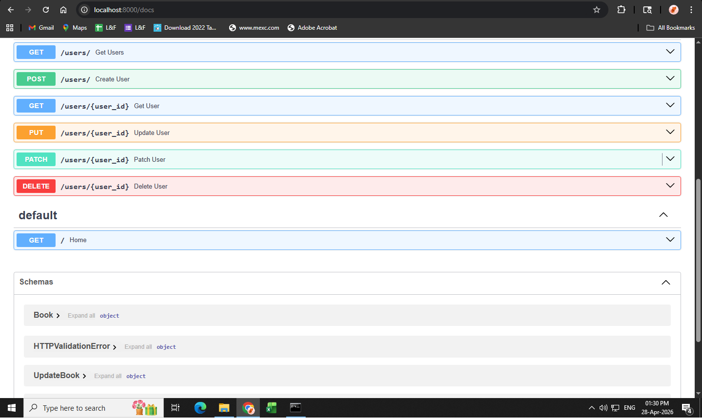
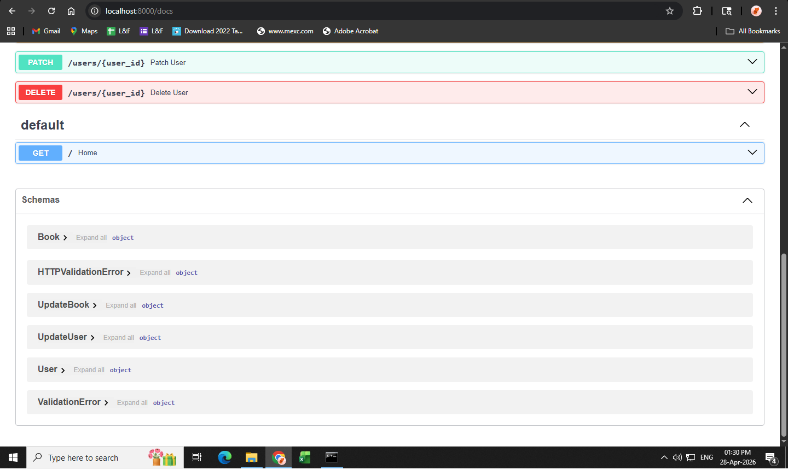
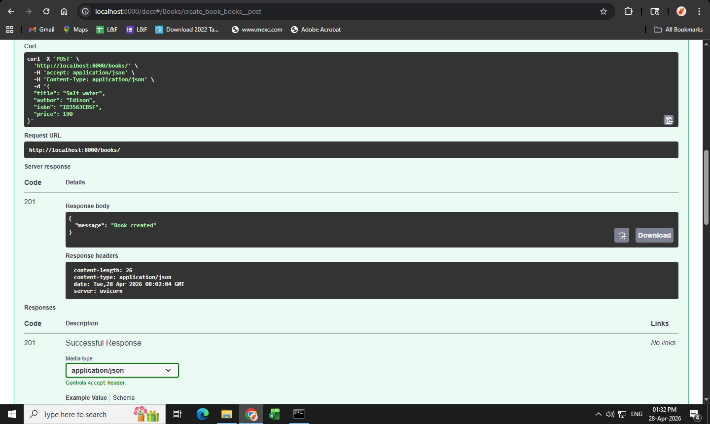
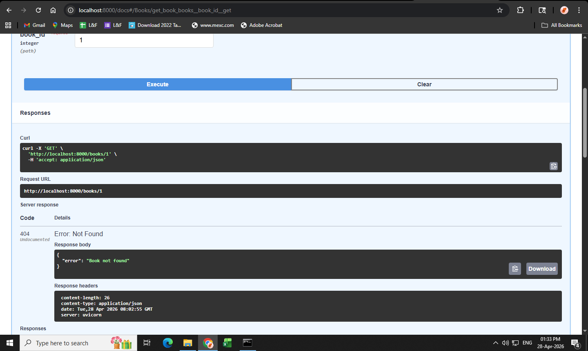

# FastAPI CRUD Assignment

A beginner-friendly REST API project built using **FastAPI** that implements full CRUD operations, validation, filtering, pagination and error handling for **Books** and **Users** resources.

---

# 📦 Project Setup Instructions (Windows)

## 1️⃣ Clone / Download the project

Extract the project and open the folder in **VS Code**.

---

## 2️⃣ Create virtual environment

Open terminal inside the project folder and run:

```bash
python -m venv venv
```

Activate the environment:

```bash
venv\Scripts\activate
```

You should see `(venv)` in terminal.

---

## 3️⃣ Install dependencies

```bash
pip install -r requirements.txt
```

Installed packages include:

* fastapi
* uvicorn
* python-multipart
* pydantic[email]
* email-validator

---

## 4️⃣ Run the FastAPI server

```bash
uvicorn app.main:app --reload
```

Server runs at:

```
http://127.0.0.1:8000
```

---

## 5️⃣ Open API Documentation

Swagger UI:

```
http://127.0.0.1:8000/docs
```

ReDoc:

```
http://127.0.0.1:8000/redoc
```

---

# 📸 Swagger UI Screenshots

## Application Home & Routes



## Books Endpoints



## Users Endpoints



## Request Body Example



## Response & Validation Errors



---

# 🧪 API Testing using REST Client

Testing is done using **VS Code REST Client extension**.

Install extension in VS Code:

* Open Extensions
* Search: **REST Client**
* Install

We use `.http` files instead of Postman.

Test files located in:

```
tests/books.http
tests/users.http
```

These files contain:

* Valid API requests
* Invalid API requests
* Edge case testing
* Error handling verification

---

# 📁 Project Structure

```
app/
 ├── main.py              → FastAPI app initialization
 ├── errors.py            → Global exception handlers
 ├── database/
 │     └── fake_db.py     → In-memory database
 ├── models/
 │     ├── book_models.py → Pydantic models for Books
 │     └── user_models.py → Pydantic models for Users
 └── routes/
       ├── book_routes.py → Books CRUD APIs
       └── user_routes.py → Users CRUD APIs

tests/
 ├── books.http
 └── users.http
```

---

# 🚀 Features Implemented

## Core FastAPI Concepts

* Application initialization and router configuration
* Path operations and decorators
* Request & response handling
* Path parameters and query parameters
* Automatic API documentation

---

## 📚 Books CRUD API

Resource fields:

* title
* author
* isbn
* price

Endpoints:

```
GET     /books
GET     /books/{id}
POST    /books
PUT     /books/{id}
PATCH   /books/{id}
DELETE  /books/{id}
```

Extra features:

* Search by author using query parameter
* Pagination using skip & limit

---

## 👤 Users CRUD API

Resource fields:

* username
* email
* age

Endpoints:

```
GET     /users
GET     /users/{id}
POST    /users
PUT     /users/{id}
PATCH   /users/{id}
DELETE  /users/{id}
```

Extra features:

* Filter users by age
* Pagination support

---

# 🔍 Query Parameters

### Search & Filter

Examples:

```
GET /books?author=Robert Martin
GET /users?age=21
```

### Pagination

Examples:

```
GET /books?skip=0&limit=5
GET /users?skip=5&limit=10
```

---

# ⚠️ Error Handling Implemented

## Global Exception Handlers

File: `app/errors.py`

Handles:

* Invalid request data
* Validation errors
* HTTP exceptions

---

## Input Validation using Pydantic

### Books Validation

* Title minimum length
* Price must be positive
* ISBN length restricted

### Users Validation

* Email must be valid format
* Age range: 1 – 119
* Username minimum length

---

## Custom Error Cases Implemented

| Scenario             | Status Code     |
| -------------------- | --------------- |
| Duplicate email      | 400 Bad Request |
| Duplicate ISBN       | 400 Bad Request |
| Invalid request body | 400 Bad Request |
| Resource not found   | 404 Not Found   |
| Wrong data type      | 400 Bad Request |

---

# 🧠 Logic Used in Project

### In-Memory Database

Instead of a real database, Python lists are used to simulate storage.

File:

```
app/database/fake_db.py
```

This allows CRUD logic without external DB setup.

---

### PUT vs PATCH

* PUT → Replace full resource
* PATCH → Update partial fields

---

### Status Codes Used

| Method       | Status      |
| ------------ | ----------- |
| GET          | 200 OK      |
| POST         | 201 Created |
| PUT          | 200 OK      |
| PATCH        | 200 OK      |
| DELETE       | 200 OK      |
| Invalid Data | 400         |
| Not Found    | 404         |

---

